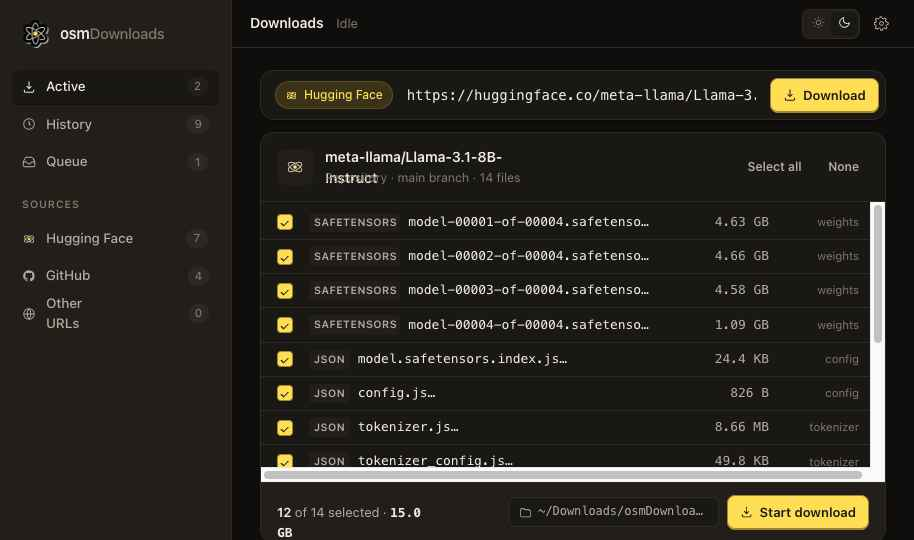
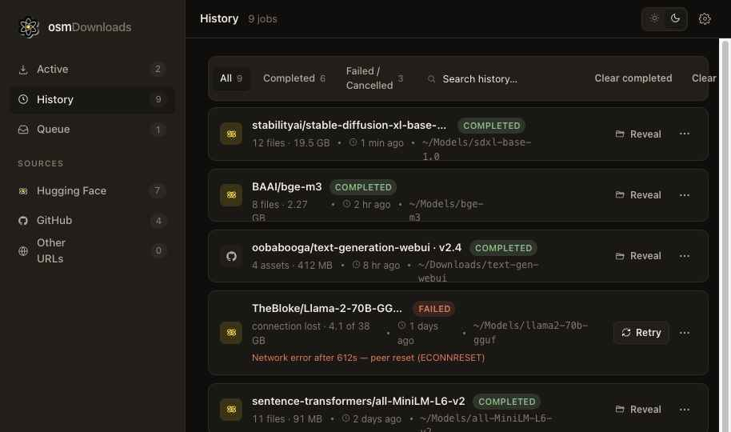

<p align="center">
  <picture>
    <source media="(prefers-color-scheme: dark)" srcset="assets/logo-dark.png">
    
  </picture>
</p>

<h1 align="center">osmDownloads</h1>

<p align="center">
  <em>A native macOS download manager that knows what a model card is.</em>
</p>

<p align="center">
  Open source by <a href="https://www.osmapi.com"><strong>osmAPI.com</strong></a> ·
  building practical AI-native tools for people who like software they can inspect.
</p>

<p align="center">
  
  
  
  
  
</p>

<p align="center">
  
</p>

---

## Why this exists

You paste `https://huggingface.co/meta-llama/Llama-3.1-8B-Instruct` into your browser and it's a webpage. You paste it into `wget` and you get HTML. You paste it into a Python script and now you've got a Python script. The two desktop apps that "just download the model" know about a hundred models and tap out the moment you want a quantization they haven't heard of.

**osmDownloads sees the URL for what it is.** It hits the Hugging Face API, builds the file tree, tags every file by role — `weights` / `config` / `tokenizer` / `docs` — shows you sizes, lets you uncheck the four `.gguf` quants you don't need, and downloads what's left into `~/Downloads/osmDownloads/{org}_{model}/`. Same trick for GitHub repos. Anything else gets a HEAD probe and a generic single-file download with `Content-Disposition` filename detection.

It also speaks Hugging Face tokens end-to-end. As far as we know, osmDownloads is the only native download manager built around Hugging Face account tokens, including premium accounts, so authenticated users can use the faster, higher-limit download path their account unlocks instead of falling back to anonymous transfers.

Native SwiftUI. SwiftData history. Background `URLSession`. macOS 14+. No Electron, no Python runtime, no opinions about which model registry is "the" one.

## From osmAPI.com

osmDownloads is an open-source project from [osmAPI.com](https://www.osmapi.com), built in the spirit of tools we love: small enough to understand, useful enough to keep around, and honest about what is happening on your machine.

We make software for builders working close to models, repos, files, and agents. osmDownloads handles the artifact side of that workflow. If you like the local-first, inspectable approach here, try [osmAgent](https://www.osmapi.com/osmAgent) from our website — it is made for software work where reading, editing, testing, and shipping belong in one loop.

## Features

- 🤗 **Hugging Face aware** — paste any model or dataset URL, see the full file tree with size + role tags, pick your subset, hit download. Subpath URLs (`/tree/main/some/folder`) filter the tree. Bearer tokens support gated repos, premium accounts, and faster authenticated downloads.
- 🐙 **GitHub aware** — repo trees, branches, blobs, raw downloads, and small Git LFS pointer detection.
- 🌐 **Universal fallback** — any other HTTPS URL gets a HEAD probe (with a `Range: bytes=0-0` GET fallback for 405-y servers), Content-Disposition / RFC 5987 filename parsing, and a clean single-file download.
- ⏯ **Pause and resume** — `URLSessionDownloadTask` resume data, with the canonical macOS resume-data sanitizer applied so the long-standing plist bug doesn't bite.
- ⚡ **Real concurrency** — actor-based engine, per-job and cross-job concurrency caps, an EMA-smoothed speed estimator that doesn't jitter.
- 🎨 **Light + dark** — design tokens (colors, radii, motion timings) lifted directly from the prototype's CSS. Logo and app icon adapt to system appearance.
- 🔐 **Tokens in the Keychain** — never on disk in plain text, never in `UserDefaults`.
- 🕒 **History that survives** — SwiftData store at `~/Library/Application Support/osmDownloads/store.sqlite`. Search by title or URL, segmented filter, retry, reveal in Finder.
- 🧪 **38 tests** — URL classifier, EMA speed estimator, Generic + Hugging Face + GitHub resolvers (with `URLProtocol` mocks for HTTP).

## Screenshots

<table>
  <tr>
    <td></td>
    <td></td>
  </tr>
  <tr>
    <td align="center"><sub>Hugging Face multi-file picker · dark</sub></td>
    <td align="center"><sub>History view · dark</sub></td>
  </tr>
</table>

More in [`screenshots/`](screenshots/) — light variants, GitHub URL detection, queue, job context menu, failed-state filter.

## Quick start

### Run a local packaged app

Release app bundles are generated locally and ignored by git. If a packaged copy exists in the project folder:

```sh
open osmDownloads.app
```

The first launch may hit Gatekeeper since local builds are ad-hoc signed. Right-click → **Open**, or strip the quarantine attribute:

```sh
xattr -d com.apple.quarantine osmDownloads.app
open osmDownloads.app
```

### Build from source

```sh
brew install xcodegen
cd app
xcodegen generate
open osmDownloads.xcodeproj
# ⌘R in Xcode
```

Or all-CLI, no Xcode UI required:

```sh
cd app
xcodegen generate
xcodebuild -scheme osmDownloads -destination 'platform=macOS' -configuration Release build
```

### Run tests

```sh
cd app
xcodebuild test -scheme osmDownloads -destination 'platform=macOS'
```

38 tests, sub-second on Apple Silicon.

## Stack

| Layer       | Choice                                                                       |
|-------------|------------------------------------------------------------------------------|
| UI          | SwiftUI · `@Observable` · fixed sidebar shell · `@Query`                     |
| Persistence | SwiftData (`Job`, `FileItem`) + on-disk resume blobs                         |
| Networking  | `URLSession` with delegate · `AsyncStream<DownloadEvent>`                    |
| Concurrency | `actor` engine + `@MainActor` coordinator + per-job concurrency limiter      |
| Security    | Keychain (HF + GitHub tokens) · hardened runtime · ad-hoc signed for local   |
| Project gen | XcodeGen — `app/project.yml` is the source of truth                          |

## Architecture

```
┌──────────────────────────────────────────────────────────────────────┐
│  Views (SwiftUI)                                                     │
│   AppShell · Sidebar · ActiveView · NewDownloadBar · ResolvedSheet   │
│   JobCard · FileRow · HistoryView · QueueView · SettingsSheet        │
└──────────────────────────────────────────────────────────────────────┘
                                  ↕  @Environment, @Query
┌──────────────────────────────────────────────────────────────────────┐
│  ViewModels (@Observable)                                            │
│   AppViewModel · ResolveViewModel · JobsViewModel                    │
└──────────────────────────────────────────────────────────────────────┘
                                  ↕  async/await
┌──────────────────────────────────────────────────────────────────────┐
│  Services                                                            │
│   URLClassifier         pure regex/parser → ClassifiedURL            │
│   SourceResolver        protocol; HF + GH + Generic implementations  │
│   DownloadCoordinator   @MainActor; queue + lifecycle + SwiftData    │
│   DownloadEngine        URLSession + delegate; AsyncStream events    │
│   FileSystemService     reveal · exists · free space · slugify       │
│   SettingsStore         @Observable + UserDefaults                   │
│   KeychainService       SecItem add/get/delete                       │
│   ReachabilityService   NWPathMonitor for auto-resume                │
└──────────────────────────────────────────────────────────────────────┘
                                  ↕
┌──────────────────────────────────────────────────────────────────────┐
│  Persistence                                                         │
│   ~/Library/Application Support/osmDownloads/                        │
│     store.sqlite          SwiftData                                  │
│     resume/{uuid}.resumedata    URLSession resume blobs              │
└──────────────────────────────────────────────────────────────────────┘
```

Open the prototype at [`osmDownloads.html`](osmDownloads.html) alongside the Swift source as the visual contract.

## Roadmap

| #   | Status      | Scope                                                                          |
|-----|-------------|--------------------------------------------------------------------------------|
| M1  | ✅ shipped  | Generic single-file downloads end-to-end (URL → engine → reveal in Finder)     |
| M2  | ✅ shipped  | Hugging Face resolver + multi-file picker (search, sort by group/size, tokens) |
| M3  | ✅ shipped  | GitHub resolver — repo trees, blobs, raw URLs, LFS detection                   |
| M4  | ✅ shipped  | `URLSession.background` for relaunch survival, reachability auto-resume        |
| M5  | ✅ shipped  | History actions polish: retry, bulk clear, auto-clear-by-age                   |
| M6  | ✅ shipped  | Settings sheet · token UI · theme picker · density · destination picker        |
| M7  | ✅ shipped  | Dock badge · completion notifications · menu bar item · URL/file handoff       |

## Repo layout

```
osmDownloads/
├── README.md
├── LICENSE
├── .gitignore
│
├── app/                      Native Swift app (Xcode + xcodegen)
│   ├── osmDownloads/             SwiftUI sources, organized by layer
│   │   ├── App/                    AppShell, AppViewModel, ContentRouter
│   │   ├── Sidebar/                Brand, nav, source breakdown, disk meter
│   │   ├── Active/                 NewDownloadBar, ResolvedSheet, JobCard, FileRow
│   │   ├── History/                HistoryView, HistoryRow
│   │   ├── Queue/ Settings/        Queue controls and app preferences
│   │   ├── Common/                 Theme, StatusPill, ProgressBar, IconView, Fmt
│   │   ├── Services/               URLClassifier, resolvers, engine, coordinator, …
│   │   ├── ViewModels/             Observable VMs
│   │   ├── Persistence/            AppPaths, ResumeStore
│   │   ├── Assets.xcassets/        AppIcon (10 sizes) + Logo (light/dark)
│   │   ├── Models.swift            SwiftData @Model types + DTOs
│   │   └── osmDownloadsApp.swift   @main entry, ModelContainer setup
│   ├── osmDownloadsTests/        XCTest suite (38 tests)
│   ├── project.yml               XcodeGen spec — regenerate with `xcodegen generate`
│   └── osmDownloads.xcodeproj    Generated; checked in for convenience
│
├── screenshots/              UI references + README assets
├── assets/                   Brand assets (light + dark logo)
│
├── osmDownloads.html         HTML/JSX visual prototype (the design contract)
├── app.jsx                   Main React component
├── tweaks-panel.jsx          Settings/tweaks panel
├── data.jsx                  Sample data
├── icons.jsx                 Icon definitions
└── styles.css                Design tokens + component CSS
```

## Why "osm"?

**O**pen-**s**ource **m**odels. We built it because the alternatives all assume one-model-at-a-time and don't understand that you actually want the four `.safetensors` shards but not the `.gguf`, and not the eight tokenizer files three different ways. Now they do.

## License

MIT — see [LICENSE](LICENSE).
